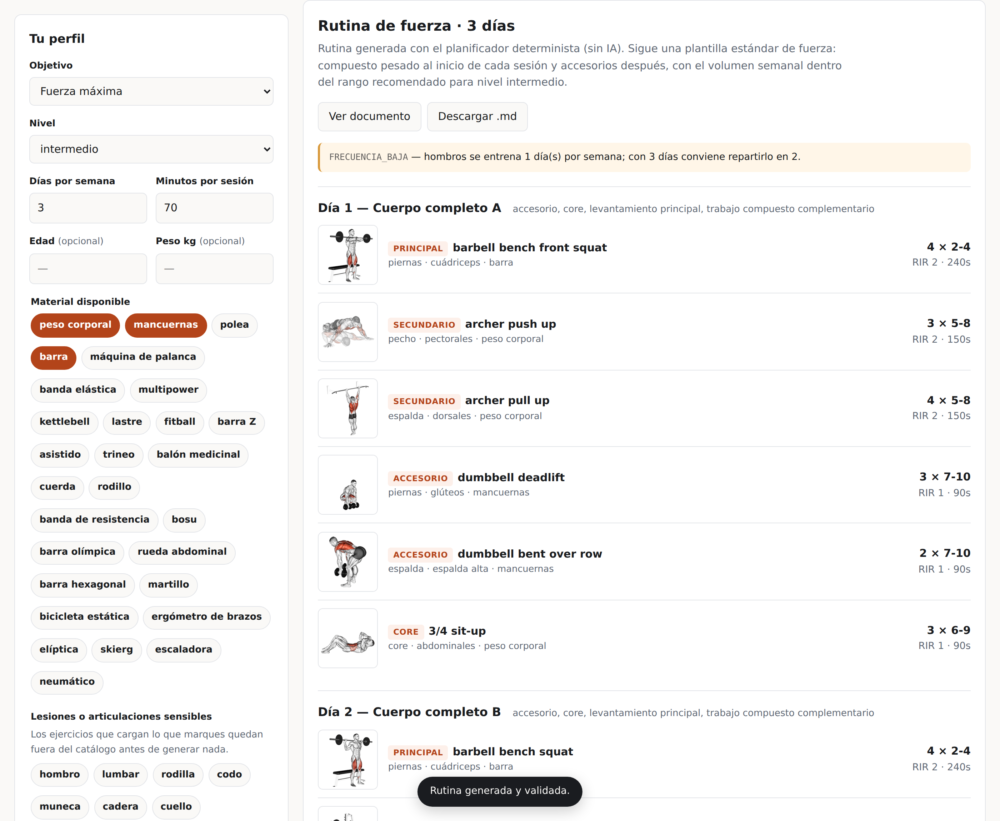
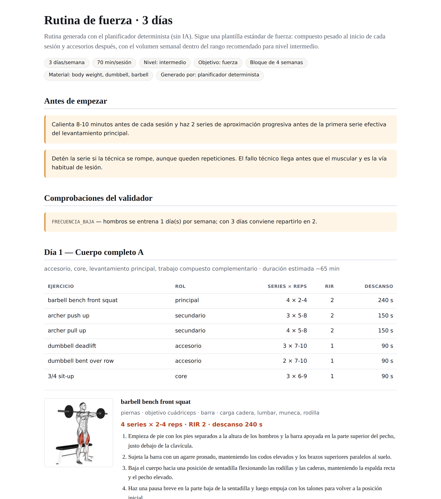

# Rutina IA

Generador de rutinas de entrenamiento con IA. Prioriza **ganancia de fuerza**
y **minimizar el riesgo de lesión**, en ese orden de importancia inversa:
cuando ambos entran en conflicto, gana la seguridad.

Se apoya en [exercises-dataset](https://github.com/hasaneyldrm/exercises-dataset)
(1.324 ejercicios con GIF de ejecución e instrucciones en español) y produce
un documento final con cada ejercicio, su prescripción y el GIF que muestra
cómo se hace.



---

## La idea

Un modelo de lenguaje escribe rutinas plausibles con facilidad. El problema es
que también escribe con la misma facilidad rutinas con 30 series semanales de
pecho, press militar para alguien con el hombro lesionado o descansos de 45
segundos entre series de peso muerto pesado. Un texto convincente no es una
rutina segura.

Aquí la IA **propone** y un validador determinista **dispone**:

```
Perfil del usuario
      │
      ├─ 1. Filtro duro ─────────► Los ejercicios que cargan una articulación
      │    (catalog.py)            lesionada, o que necesitan material que no
      │                            tienes, se eliminan del catálogo ANTES de
      │                            que el modelo vea nada.
      │
      ├─ 2. Generación ──────────► Claude elige entre los candidatos que
      │    (ai.py /                quedan, por id exacto, con un esquema de
      │     claude_code.py)        salida cerrado. No puede inventarse un
      │                            ejercicio ni devolver texto suelto.
      │
      ├─ 3. Validación ──────────► Volumen semanal, rangos de repetición, RIR
      │    (programming.py)        mínimo por nivel, descansos, duración de la
      │                            sesión, frecuencia y equilibrio de patrones.
      │
      └─ 4. Reparación ──────────► Si algo incumple, se le devuelve al modelo
           (engine.py)             el informe de errores para que lo corrija.
                                   Hasta 2 intentos; lo que quede sin resolver
                                   sale como aviso visible en el documento.
```

El paso 1 es lo que hace que la restricción por lesión sea una garantía y no
una promesa: un ejercicio contraindicado no está en el prompt, así que el
modelo no puede prescribirlo aunque quisiera. El paso 3 es la segunda barrera,
por si el catálogo o el filtro fallan.

## Qué se valida

Todo vive en [`rutina_ia/programming.py`](rutina_ia/programming.py), en un
único sitio para que se pueda discutir y ajustar sin tocar nada más.

| Regla | Bloquea | Motivo |
| --- | --- | --- |
| Series semanales por grupo dentro de rango | sí (por exceso) | El exceso de volumen es la vía más común de sobreuso |
| Ejercicio contraindicado por lesión | sí | Segunda barrera tras el filtro de catálogo |
| Material no disponible | sí | Una rutina que no puedes ejecutar no sirve |
| RIR por debajo del mínimo del nivel | sí | Un principiante pierde la técnica antes que el músculo |
| Número de días distinto al pedido | sí | |
| Repeticiones fuera del rango del objetivo | aviso | Los isométricos se miden en segundos, no aquí |
| Duración de un isométrico fuera de 10-120 s | aviso | |
| Descanso insuficiente para el rol | aviso | Descanso corto en un básico = técnica degradada |
| Duración estimada > tiempo disponible | aviso | |
| Frecuencia semanal por grupo < 2 días | aviso | Repartir rinde más y lesiona menos |
| Día sin ningún compuesto | aviso | La fuerza se construye sobre los básicos |

El volumen cuenta las series completas para el músculo objetivo y a la mitad
para los sinergistas: un press de banca entrena tríceps, pero no tanto como
una extensión de tríceps.

## Adaptaciones

Una vez generada, se le puede pedir cambios en lenguaje natural: *«me molesta
el hombro en el press, cámbialo»*, *«solo tengo 45 minutos»*, *«quiero
centrarme en la sentadilla»*. La rutina se rehace entera conservando lo que no
has pedido cambiar, y vuelve a pasar por el validador completo. Un cambio no
puede colar una rutina inválida.

## Motores: de dónde sale la inteligencia

La app puede hablar con Claude por dos vías, y funciona sin ninguna de ellas.

| Motor | Qué usa | Qué consume | Requiere |
| --- | --- | --- | --- |
| `suscripcion` | El CLI de Claude Code de tu máquina | Tu plan **Pro o Max** | `claude login` |
| `api` | La API de Anthropic | Saldo de API, por uso | `ANTHROPIC_API_KEY` |
| `determinista` | Plantillas locales | Nada | — |

Por defecto (`auto`) se prefiere la suscripción: si ya pagas un plan, generar
una rutina no debería costarte saldo aparte. El orden es
suscripción → API → determinista, y se puede fijar con `RUTINA_IA_ENGINE` o
desde el selector de la interfaz.

**Lo que no cambia entre motores es lo que importa**: el mismo esquema de
salida, el mismo filtro por lesión, el mismo validador y el mismo bucle de
reparación. Solo cambia quién ejecuta la inferencia y quién la paga.

### Cómo funciona el puente a la suscripción

No hay tokens que extraer ni credenciales que manipular. El motor invoca el
CLI de Claude Code —que ya resuelve su propia autenticación— con la salida
forzada por `--json-schema` (el mismo esquema que usa la herramienta en el
motor de API) y reanudando la sesión con `--resume` para las correcciones.

```bash
npm install -g @anthropic-ai/claude-code
claude login          # inicia sesión con tu cuenta Pro/Max
uvicorn rutina_ia.api:app   # la app lo detecta sola
```

Lo que conviene saber antes de usarlo:

- **Es para uso local o personal.** Requiere Claude Code con sesión iniciada
  en la misma máquina que sirve la app. No sirve para montar un servicio
  multiusuario con una sola suscripción, y hacerlo incumpliría las
  condiciones de tu plan.
- **Consume de los límites de tu plan.** Si agotas la ventana de uso, las
  peticiones fallan hasta que se renueve; la app lo dice con ese mensaje.
- **Tarda más.** Una rutina con reparación incluida ronda los 3-6 minutos
  frente a los ~1-2 del motor de API. Sube `RUTINA_IA_CLAUDE_CODE_TIMEOUT` si
  te quedas corto.
- **Sin control de `effort`.** El CLI no lo expone, así que el ajuste fino de
  profundidad de razonamiento solo existe en el motor de API.
- Al modelo se le retiran las herramientas de disco, shell y red, y se ignoran
  `CLAUDE.md`, hooks y ajustes del usuario: la generación depende solo de lo
  que envía este código.

## Instalación

```bash
git clone <este-repo> && cd rutina-ia
pip install -r requirements.txt

# Genera el catálogo desde el dataset original (~2,4 MB, descarga 17 MB)
python scripts/build_catalog.py

# Elige una vía para la parte de IA (o ninguna):
claude login                              # usa tu suscripción Pro/Max
cp .env.example .env && $EDITOR .env      # o una clave de API

uvicorn rutina_ia.api:app --reload
```

Abre <http://localhost:8000>.

**Sin ninguna de las dos la aplicación funciona igual**, con un planificador
determinista basado en plantillas que pasa el mismo validador. Lo que se
pierde es la adaptación por lenguaje natural, que sí requiere un modelo.

### GIF sin conexión (opcional)

```bash
python scripts/fetch_media.py    # ~1.324 GIF, unos 150 MB
```

Con la copia local, el documento exportado incrusta los GIF como data URI y
queda 100 % autocontenido: lo puedes guardar en el móvil y consultarlo en el
gimnasio sin cobertura. El directorio está en `.gitignore` a propósito (ver
[Licencias](#licencias)).

## El documento final

Desde la interfaz, **Ver documento** genera un HTML imprimible con:

- Ficha por ejercicio: GIF de ejecución, músculo objetivo, material,
  articulaciones que carga e instrucciones paso a paso en español.
- Tabla resumen por sesión con series, repeticiones, RIR y descansos.
- Volumen semanal por grupo muscular.
- Progresión, descarga y notas de seguridad.
- Los avisos del validador que no se hayan podido resolver.



También hay exportación a Markdown (**Descargar .md**).

## API

Servidor sin estado: el cliente conserva la rutina y la reenvía. Cualquier
rutina se puede reproducir con solo su JSON.

| Método | Ruta | Qué hace |
| --- | --- | --- |
| `GET` | `/api/options` | Material, articulaciones, objetivos y motores disponibles |
| `POST` | `/api/routines` | Genera una rutina. `engine`: `auto` \| `suscripcion` \| `api` \| `determinista` |
| `POST` | `/api/routines/adapt` | Aplica un cambio en lenguaje natural (requiere un modelo) |
| `POST` | `/api/document.html` | Documento imprimible. `?embed=1` incrusta los GIF |
| `POST` | `/api/document.md` | Mismo documento en Markdown |
| `GET` | `/api/exercises/{id}` | Ficha de un ejercicio |
| `GET` | `/api/health` | Comprobación de vida |

```bash
curl -X POST localhost:8000/api/routines \
  -H 'content-type: application/json' \
  -d '{"profile": {"goal": "fuerza", "experience": "intermedio",
                   "days_per_week": 4, "session_minutes": 70,
                   "equipment": ["barbell", "dumbbell", "body weight"],
                   "injuries": ["hombro"]}}'
```

## Configuración

Todo por variables de entorno; ver [`.env.example`](.env.example). Lo
relevante: `RUTINA_IA_ENGINE` para fijar el motor, `ANTHROPIC_API_KEY` si usas
la vía de API, y `ANTHROPIC_MODEL` / `ANTHROPIC_EFFORT` para ajustarla (por
defecto `claude-opus-5` y `high` — una rutina mal periodizada cuesta más que
unos cuantos tokens de razonamiento).

## Tests

```bash
pytest
```

94 tests, sin red y sin lanzar el CLI (`conftest.py` bloquea los subprocesos
que no estén falseados a propósito). Los dos motores se prueban con dobles: lo
que se comprueba es el contrato alrededor del modelo —forma de la invocación,
bucle de reparación, rechazos, valores fuera de rango y traducción de los
fallos a mensajes accionables—, que es la parte que puede romperse en
silencio.

El planificador determinista se valida contra 1.620 combinaciones de perfil
(días × nivel × objetivo × material × lesiones) sin producir ni un solo error
bloqueante.

## Estructura

```
rutina_ia/
  catalog.py       Carga del catálogo y filtrado duro por lesión/material
  programming.py   Reglas de programación y validador determinista
  models.py        Perfil, rutina, bloques, incidencias
  prompts.py       Prompt de sistema y plantillas de generación/adaptación
  engine.py        Esquema de salida y bucle de validación/reparación común
  ai.py            Motor de API: tool use estricto
  claude_code.py   Motor de suscripción: puente al CLI de Claude Code
  fallback.py      Planificador determinista (sin modelo)
  export.py        Documento final en HTML y Markdown
  api.py           API HTTP (FastAPI)
scripts/
  build_catalog.py Construye data/catalog.json desde el dataset original
  fetch_media.py   Descarga opcional de los GIF para uso sin conexión
```

## Licencias

- **Este código**: MIT.
- **Datos de ejercicios** (nombres, categorías, instrucciones): MIT, de
  [exercises-dataset](https://github.com/hasaneyldrm/exercises-dataset).
- **GIF e imágenes de ejecución**: © [Gym visual](https://gymvisual.com/). **No
  están cubiertos por la licencia MIT del dataset.** Este proyecto los enlaza
  a la fuente original en vez de copiarlos, y conserva la atribución en cada
  documento generado. Si vas a distribuir tu propia copia, revisa antes las
  [condiciones de uso de Gym visual](https://gymvisual.com/content/3-terms-and-conditions-of-use)
  y obtén tu licencia. Por eso `data/media/` está en `.gitignore`.

## Aviso

Material informativo de entrenamiento. No es consejo médico ni sustituye la
valoración de un profesional sanitario. El filtro por lesión reduce la
exposición de una articulación, no diagnostica ni rehabilita nada. Ante dolor,
para y consulta.
